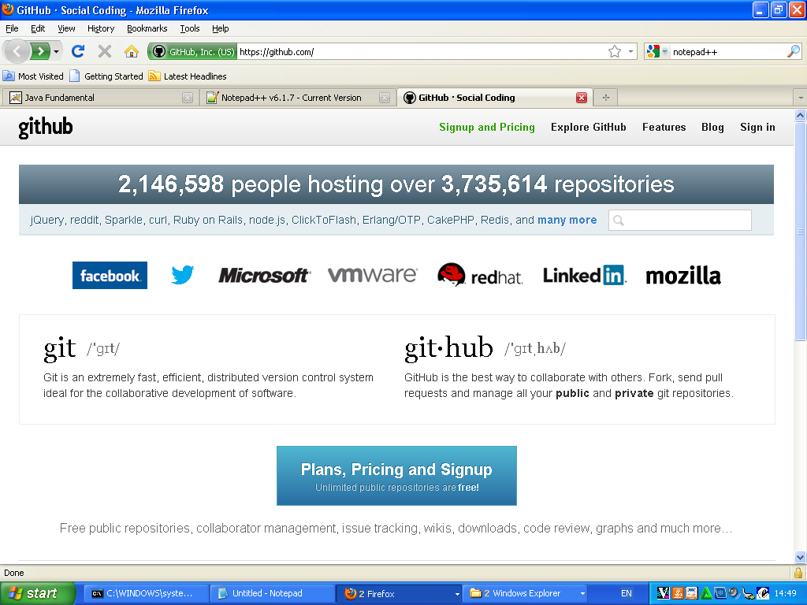
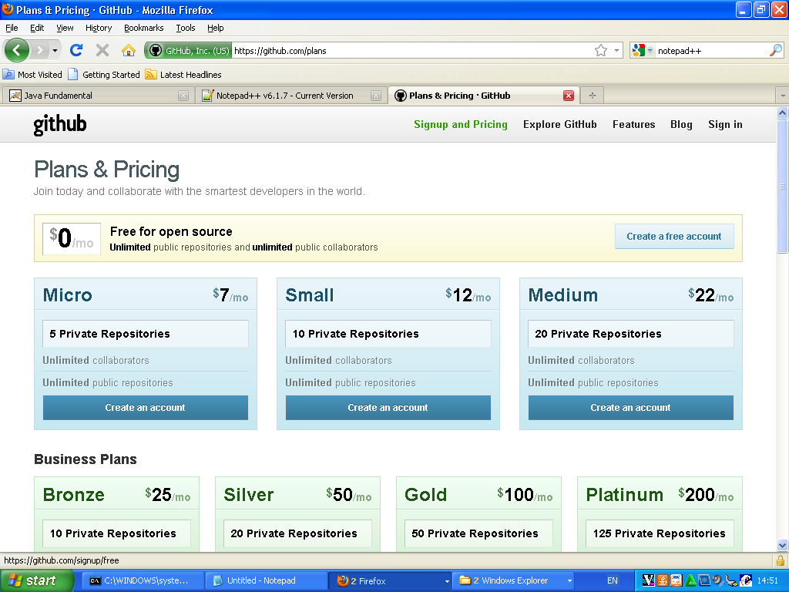

# Persiapan Pemrograman Java #

## Kebutuhan Aplikasi ##

Untuk membuat kode program Java, kita harus menginstal:

- Java SDK versi 6 : untuk melakukan kompilasi kode program 
    dan menjalankannya

- Notepad++ : untuk mengedit kode program supaya ada warnanya

- Git : untuk menyimpan file (catatan dan source code) ke github.com
    Git untuk Windows bisa diunduh [di sini](http://code.google.com/p/msysgit/downloads/list?q=full+installer+official+git)

## Referensi ##

Referensi berbahasa Indonesia:

- [Buku Java Desktop Ifnu Bima]

Referensi berbahasa Inggris : 
- [Tutorial resmi Java dari Oracle]

[Buku Java Desktop Ifnu Bima]: https://kpli-jakarta-code.googlecode.com/files/Java%20Desktop%20-%20Ifnu%20Bima.pdf
[Tutorial resmi Java dari Oracle]: http://docs.oracle.com/javase/tutorial/

# Menggunakan Github #

## Buat account Github ##

Berikut adalah langkah-langkah untuk membuat account Github:

### Masuk ke website Github ###

### Pilih Signup Free Account ###

